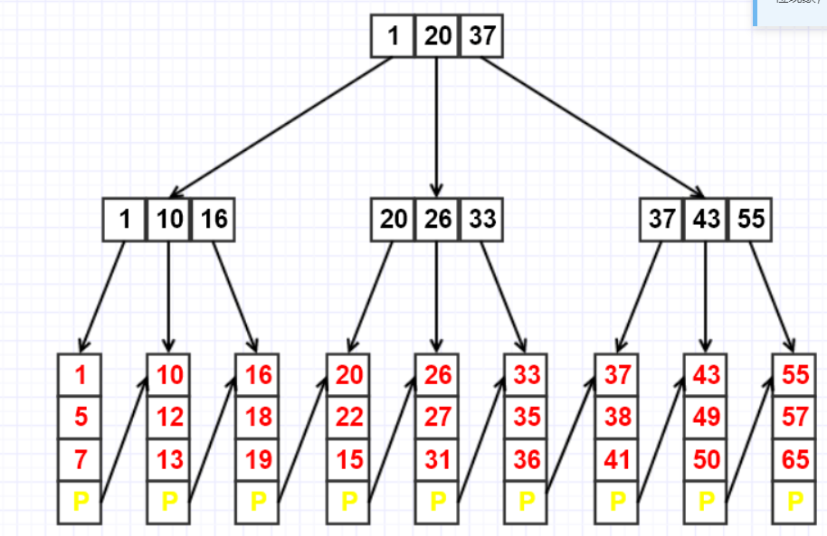
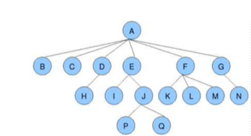
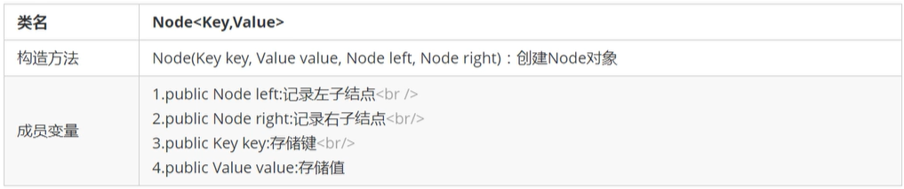
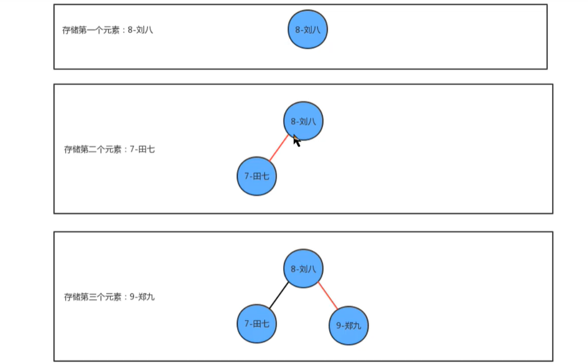
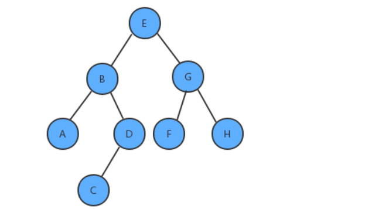
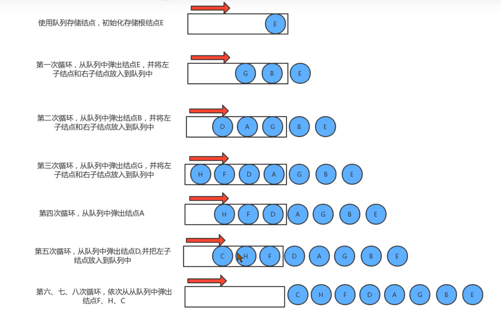

## 二叉树入门

之前我们实现的符号表中,不难看出,符号表的增删查操作,随着元素个数N的增多,其耗时也是线性增多的,时间复杂度都是0(n),
为了提高运算效率,接下来我们学习树这种数据结构。

**场景**

**java中的``HashMap``**


**数据库索引**



### 1.1树的基本定义

树是我们计算机中非常重要的一种数据结构,同时使用树这种数据结构,可以描述现实生活中的很多事物,例如家谱、单位的组织架
构、等等。
树是由n ( n>=1 )个有限结点组成一个具有层次关系的集合。 把它叫做”树”是因为它看起来像一棵倒挂的树,也就是说它是根朝上,而
叶朝下的。



树具有以下特点:

1. 每个结点有零个或多个子结点;
2. 没有父结点的结点为根结点;
3. 每一个非根结点只有一个父结点 ;
4. 每个结点及其后代结点整体上可以看做是一棵树,称为当前结点的父结点的一个子树; 

### 1.2树的相关术语

**结点的度:**

一个结点含有的子树的个数称为该结点的度;

**叶结点:**

度为0的结点称为叶结点,也可以叫做终端结点；

**分支结点:**

度不为0的结点称为分支结点,也可以叫做非终端结点；

**结点的层次:** 

从根结点开始,根结点的层次为1 ,根的直接后继层次为2 ,以此类推；

**结点的层序编号:**

将树中的结点,按照从上层到下层,同层从左到右的次序排成一个线性序列,把他们编成连续的自然数。
**树的度:**
树中所有结点的度的最大值

**树的高度(深度) :**

树中结点的最大层次

**森林:**

m ( m>=0 )个互不相交的树的集合,将一颗非空树的根结点删去,树就变成一个森林;给森林增加一个统- -的根结点,森林就变
成一棵树

### 1.3二叉树的基本定义

二叉树就是度不超过2的树(每个结点最多有两个子结点)


**满二叉树**

一个二叉树,如果每一个层的结点树都达到最大值,则这个二叉树就是满二叉树。


**完全二叉树:**

叶节点只能出现在最下层和次下层,并且最下面一层的结点都集中在该层最左边的若干位置的二_叉树


### 1.4二叉树的创建

根据对图的观察,我们发现二叉树其实就是由一个-一个的结点及其之间的关系组成的,按照面向对象的思想,我们设计一个结点类来描述结点事物。

**结合类API设计：**



```java
//树结点
public class Node<Key extends Comparable<Key>,Value> {
    //比较Key
    public Key key;
    //左节点
    public Node<Key,Value> left;
    //右节点
    public Node<Key,Value> right;
    //值
    public Value value;

    public Node(Key key, Value value) {
        this.key = key;
        this.value = value;
    }
```

**插入方法put实现思想:**
1.如果当前树中没有任何一个结点,则直接把新结点当做根结点使用
2.如果当前树不为空,则从根结点开始:
2.1如果新结点的key小于当前结点的key ,则继续找当前结点的左子结点;
2.2如果新结点的key大于当前结点的key ,则继续找当前结点的右子结点;
2.3如果新结点的key等于当前结点的key ,则树中已经存在这样的结点,替换该结点的value值即可。




```java
//插入
public void put(Key key,Value value){
    root = put(root,key,value);

}

private Node<Key,Value> put(Node<Key,Value> node,Key key,Value value){
    if(node == null){
        //创建新节点
        node = new Node<>(key,value);
        N++;
        return node;
    } 
   int compareResult = key.compareTo(node.key);
    //如果小于当前结点，向继续向子左结点查找并插入
   if(compareResult<0){
        node.left = put(node.left,key,value);
    //如果大于当前结点，向继续向子右结点查找并插入   
   } else if(compareResult >0){
       node.right = put(node.right,key,value);
   }else{
       //替换Value
       node.value = value;
   }
    return node;
}
```

**查询方法Get实现思想:**
从根节点开始:
1.如果要查询的key小于当前结点的key ,则继续找当前结点的左子结点;
2.如果要查询的key大于当前结点的key ,则继续找当前结点的右子结点;
3.如果要查询的key等于当前结点的key ,则树中返回当前结点的value。
2.3如果新结点的key等于当前结点的key ,则树中已经存在这样的结点,替换该结点的value值即可。

```java
//查询
public Value get(Key key){
   return get(root,key);
}

private Value get(Node<Key,Value> node,Key key){
    if( node == null){
        return null;
    }
    int compareResult = key.compareTo(node.getKey());
     //如果小于当前结点，向继续向子左结点查找
    if(compareResult <0){
        return get(node.left,key);
         //如果大于当前结点，向继续向子右结点查找
    }else if(compareResult >0){
        return get(node.right,key);
    }else{
        return node.value;
    }
}
```

**删除方法delete实现思想: **
1.找到被删除结点;
2.找到被删除结点右子树中的最小结点minNode
3.删除右子树中的最小结点
4.让被删除结点的左子树称为最小结点minNode的左子树,让被删除结点的右子树称为最小结点minNode的右子树
5.让被删除结点的父节点指向最小结点**minNode**


```java
//删除
public void delete(Key key){
  delete(root,key);
}

private Node<Key,Value> delete(Node<Key,Value> node,Key key){
    if(node == null){
        return null;
    }
    int compareResult = key.compareTo(node.getKey());
    if(compareResult <0){
        //向左边查找  重新挂载左节点
        node.left = delete(node.left,key);
    }else if(compareResult >0){
        //向右查找 重新挂载右节点
        node.right = delete(node.right,key);
    }else{
        //找到了删除结点
        N--;
        //如果左右结点有为空的，则直接将左或右结点返回
       if(node.left == null){
           return node.right;
       }
       if(node.right == null){
           return node.left;
       }
       Node<Key,Value> minNode = node.right;
        //查找到12结点
       while (minNode.left != null){
           minNode = minNode.left;
       }
        Node<Key,Value> n = node.right;
		//查找到14结点，并清除左12结点
       while (n.left != null){
           //判断左节点的左节点是否为空，找到了14结点了
           if(n.left.left == null){
               n.left = null;
           }else{
               //继续查找
               n = n.left;
           }
       }
       //12结点左右结点挂载node 10左右结点
       minNode.left = node.left;
       minNode.right = node.right;
       //返回12结点挂载到20结点上去 
       node = minNode;
    }
    return node;

}
```

### 1.5二叉树的基本遍历（深度优先）

很多情况下,我们可能需要像遍历数组数组-样,遍历树,从而拿出树中存储的每一个元素 ,由于树状结构和线性结构不一-样,它没
有办法从头开始依次向后遍历,所以存在如何遍历,也就是按照什么样的搜索路径进行遍历的问题。

我们把树简单的画作上图中的样子,由一个根节点、一个左子树、 一个右子树组成 ,那么按照根节点什么时候被访问,我们可以把二
叉树的遍历分为以下三种方式:

#### 1.前序遍历;
先访问根结点,然后再访问左子树,最后访问右子树

**实现步骤:**

1. 把当前结点的key放入到队列中;

2. 找到当前结点的左子树,如果不为空,递归遍历左子树

3. 找到当前结点的右子树,如果不为空,递归遍历右子树

   2.2如果当前结点的左子结点不为空,则把左子结点放入到队列中
   2.3如果当前结点的右子结点不为空,则把右子结点放入到队列中



```java
//前序遍历
public Queue<Key> perErgodic(){
    Queue<Key> queue = new LinkedList<>();
     perErgodic(root,queue);
     return queue;
}

//前序遍历
private void perErgodic(Node<Key,Value> node, Queue<Key> queue){
    if(node == null){
        return;
    }
    queue.add(node.key);
    perErgodic(node.left,queue);
    perErgodic(node.right,queue);
}
```


**实现结果：EBADCGFH**

#### 2.中序遍历;

先访问左子树,中间访问根节点,最后访问右子树

**实现步骤:**

1. 找到当前结点的左子树,如果不为空,递归遍历左子树

2. 把当前结点的key放入到队列中;

3. 找到当前结点的右子树,如果不为空,递归遍历右子树

   2.2如果当前结点的左子结点不为空,则把左子结点放入到队列中
   2.3如果当前结点的右子结点不为空,则把右子结点放入到队列中


```java
 //中序遍历
    public Queue<Key> midErgodic(){
        Queue<Key> queue = new LinkedList<>();
        midErgodic(root,queue);
        return queue;
    }
//中序遍历
private void midErgodic(Node<Key,Value> node, Queue<Key> queue){
    if(node == null){
        return;
    }

    midErgodic(node.left,queue);
    queue.add(node.key);
    midErgodic(node.right,queue);
}
```

**实现结果：ABCDEFGH**


#### 3.后序遍历;

先访问左子树,再访问右子树,最后访问根节点

**实现步骤: **

1. 找到当前结点的左子树,如果不为空,递归遍历左子树
2. 找到当前结点的右子树,如果不为空,递归遍历右子树
3. 把当前结点的key放入到队列中;
   2.2如果当前结点的左子结点不为空,则把左子结点放入到队列中
   2.3如果当前结点的右子结点不为空,则把右子结点放入到队列中


```java
//后序遍历
public Queue<Key> afterErgodic(){
    Queue<Key> queue = new LinkedList<>();
    afterErgodic(root,queue);
    return queue;
}

//后序遍历
private void afterErgodic(Node<Key,Value> node, Queue<Key> queue){
    if(node == null){
        return;
    }
    afterErgodic(node.left,queue);
    afterErgodic(node.right,queue);
    queue.add(node.key);
}
```

**运行结果：ACDBFHGE**

### 1.6二叉树的层序遍历（广度优先）

**实现步骤:**

1. 创建队列,存储每一层的结点;
2. 使用循环从队列中弹出一个结点:
   2.1 获取当前结点的key ;
   2.2 如果当前结点的左子结点不为空,则把左子结点放入到队列中
   2.3 如果当前结点的右子结点不为空,则把右子结点放入到队列中


**代码编写：**

```java
//层序遍历
public Queue<Key> layerErgodic(){
    Queue<Key> keys= new LinkedList<>();
    Queue<Node<Key,Value>> nodes = new LinkedList<>();
    nodes.add(root);
    while (!nodes.isEmpty()){
        Node<Key,Value> n = nodes.poll();
        keys.add(n.key);
        //添加了左节点放到队列中
        if(n.left != null){
            nodes.add(n.left);
        }
        //添加了右节点放到队列中
        if(n.right != null){
            nodes.add(n.right);
        }
    }
    return keys;
}
```

**运行结果：EBGADFHC**

### 1.7二叉树的最大深度问题

**需求：**

给定一棵树,请计算树的最大深度(树的根节点到最远叶子结点的最长路径上的结点数);


**实现步骤:**

1. 如果根结点为空,则最大深度为0 ;

2. 计算左子树的最大深度;

3. 计算右子树的最大深度; 

4. 当前树的最大深度=左子树的最大深度和右子树的最大深度中的较大者+1

   ```java
   public int getMaxDepth(){
       return  getMaxDepth(root);
   }
   
   private int getMaxDepth(Node<Key,Value> node){
       if(node == null){
           return 0;
       }
       int max = 0;
       int leftMax = 0;
       int rightMax =0;
       if(node.left != null){
           leftMax =  getMaxDepth(node.left);
       }if(node.right != null){
           rightMax =  getMaxDepth(node.right);
       }
         max =  Math.max(leftMax,rightMax)+1;
       return max;
   }
   ```


### 1.8.源码

```java
//二叉树
public class BinaryTree<Key extends Comparable<Key>,Value> {
   //根节点
    private Node<Key,Value> root;
    private int N;

    public int getSize() {
        return N;
    }

    //插入
    public void put(Key key,Value value){
        root = put(root,key,value);

    }

    private Node<Key,Value> put(Node<Key,Value> node,Key key,Value value){
        if(node == null){
            node = new Node<>(key,value);
            N++;
            return node;
        }
       int compareResult = key.compareTo(node.key);
       if(compareResult<0){
            node.left = put(node.left,key,value);
       } else if(compareResult >0){
           node.right = put(node.right,key,value);
       }else{
           node.value = value;
       }
        return node;
    }

    //查询
    public Value get(Key key){
       return get(root,key);
    }

    private Value get(Node<Key,Value> node,Key key){
        if( node == null){
            return null;
        }
        int compareResult = key.compareTo(node.key);
        if(compareResult <0){
            return get(node.left,key);
        }else if(compareResult >0){
            return get(node.right,key);
        }else{
            return node.value;
        }
    }

    //删除
    public void delete(Key key){
      delete(root,key);
    }

    private Node<Key,Value> delete(Node<Key,Value> node,Key key){
        if(node == null){
            return null;
        }
        int compareResult = key.compareTo(node.key);
        if(compareResult <0){
            node.left = delete(node.left,key);
        }else if(compareResult >0){
            node.right = delete(node.right,key);
        }else{
            N--;
           if(node.left == null){
               return node.right;
           }
           if(node.right == null){
               return node.left;
           }
           Node<Key,Value> minNode = node.right;
           while (minNode.left != null){
               minNode = minNode.left;
           }
            Node<Key,Value> n = node.right;

           while (n.left != null){
               if(n.left.left == null){
                   n.left = null;
               }else{
                   n = n.left;
               }
           }
           minNode.left = node.left;
           minNode.right = node.right;
           node = minNode;
        }
        return node;

    }

    public Node<Key,Value> min(){
       return min(root);
    }

    private Node<Key,Value> min(Node<Key,Value> node){
       if(node == null){
           return null;
       }
       if(node.left != null){
           return min(node.left);
       }
       return node;
    }


    public Node<Key,Value> max(){
        return max(root);
    }

    private Node<Key,Value> max(Node<Key,Value> node){
        if(node == null){
            return null;
        }
        if(node.right != null){
            return max(node.left);
        }
        return node;
    }

    //前序遍历
    public Queue<Key> perErgodic(){
        Queue<Key> queue = new LinkedList<>();
         perErgodic(root,queue);
         return queue;
    }

    //前序遍历
    private void perErgodic(Node<Key,Value> node, Queue<Key> queue){
        if(node == null){
            return;
        }
        queue.add(node.key);
        perErgodic(node.left,queue);
        perErgodic(node.right,queue);
    }

    //中序遍历
    public Queue<Key> midErgodic(){
        Queue<Key> queue = new LinkedList<>();
        midErgodic(root,queue);
        return queue;
    }

    //中序遍历
    private void midErgodic(Node<Key,Value> node, Queue<Key> queue){
        if(node == null){
            return;
        }

        midErgodic(node.left,queue);
        queue.add(node.key);
        midErgodic(node.right,queue);
    }

    //后序遍历
    public Queue<Key> afterErgodic(){
        Queue<Key> queue = new LinkedList<>();
        afterErgodic(root,queue);
        return queue;
    }

    //后序遍历
    private void afterErgodic(Node<Key,Value> node, Queue<Key> queue){
        if(node == null){
            return;
        }
        afterErgodic(node.left,queue);
        afterErgodic(node.right,queue);
        queue.add(node.key);
    }


    //层序遍历
    public Queue<Key> layerErgodic(){
        Queue<Key> keys= new LinkedList<>();
        Queue<Node<Key,Value>> nodes = new LinkedList<>();
        nodes.add(root);
        while (!nodes.isEmpty()){
            Node<Key,Value> n = nodes.poll();
            keys.add(n.key);
            //添加了左节点放到队列中
            if(n.left != null){
                nodes.add(n.left);
            }
            //添加了右节点放到队列中
            if(n.right != null){
                nodes.add(n.right);
            }
        }
        return keys;
    }

    public int getMaxDepth(){
        return  getMaxDepth(root);
    }

    private int getMaxDepth(Node<Key,Value> node){
        if(node == null){
            return 0;
        }
        int max = 0;
        int leftMax = 0;
        int rightMax =0;
        if(node.left != null){
            leftMax =  getMaxDepth(node.left);
        }if(node.right != null){
            rightMax =  getMaxDepth(node.right);
        }
          max =  Math.max(leftMax,rightMax)+1;
        return max;
    }

}
```


