# 平衡树

之前我们学习过二叉查找树,发现它的查询效率比单纯的链表和数组的查询效率要高很多,大部分情况下,确实是这样的,不幸的是,在最坏情况下,二叉查找树的性能还是很糟糕。
例如我们依次往二叉查找树中插入9,8,7,6,5,4,3,2,1这9个数据,那么最终构造出来的树是长得下面这个样子:

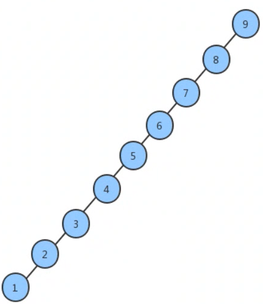

我们会发现,如果我们要查找1这个元素,查找的效率依旧会很低。效率低的原因在于这个树并不平衡,全部是向左边分支,如果我们有一种方法,能够不受插入数据的影响,让生成的树都像完全: -叉树那样,那么即使在最坏情况下,查找的效率依旧会很好。

## 1.1 2-3查找树

为了保证查找树的平衡性,我们需要一些灵活性 ,因此在这里我们允许树中的一个结点保存多个键。确切的说,我们将一棵标准的二 二叉查找树中的结点称为2结点(含有一个 键和两条链) ,而现在我们引入3-结点,它含有两个键和三E条链。2-结点和3结点中的每条链都对应着其中保存的键所分割产生的一个区间。
### 1.1.1 2-3查找树的定义

一棵2-3查找树要么为空 ,要么满足满足下面两个要求:
**结点:**
含有一个键(及其对应的值)和两条链,左链接指向2-3树中的键都小于该结点,右链接指向的2-3树中的键都大于该结点。
含有两个键(及其对应的值)和三条链,左链接指向的2-3树中的键都小于该结点,中链接指向的2-3树中的键都位于该结点的两个键之间,右链接指向的2 3树中的键都大于该结点。

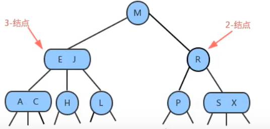

### 1.1.2 2-3查找

将二叉查找树的查找算法一般化我们就能够 直接得到2-3树的查找算法。要判断一个键是否在树中,我们先将它和根结点中的键比较。如果它和其中任意一个相等， 查找命中 ;否则我们就根据比较的结果找到指向相应区间的连接,并在其指向的子树中递归地继续查找如里这个旦空链接查找未命中.

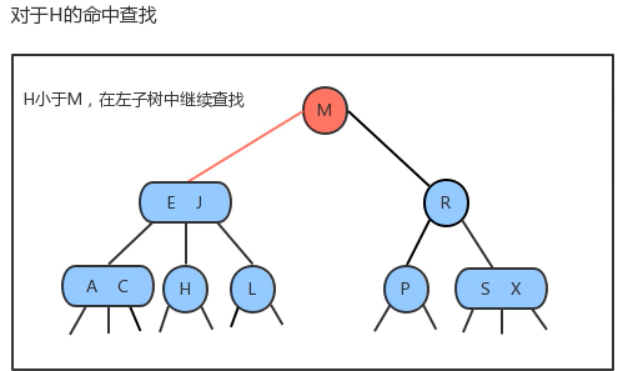

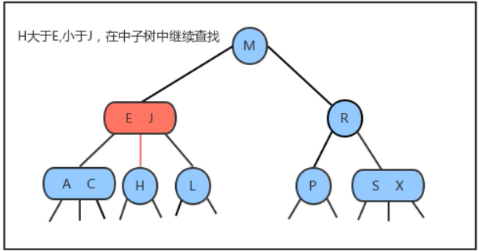

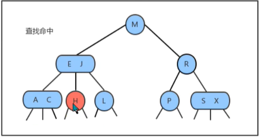


### 1.1.3 2-3插入
#### 1.1.3.1向2-结点中插入新键 
往2-3树中插入元素和往二=叉查找树中插入元素-样,首先要进行查找,然后将节点挂到未找到的节点上。2-3树之 所以能够保证在最差的情况下的效率的原因在于其插入之后仍然能够保持平衡状态。如果查找后未找到的节点是一个2.结点 ,那么很容易,我们只需要将新的元素放到这个2-结点里面使其变成一个3-结点即可。 但是如果查找的节点结束于-个3-结点 ,那么可能有点麻烦。

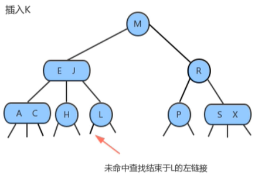

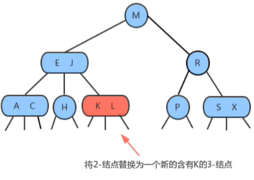

#### 1.1.3.2向棵只含有一一个3-结点的树中插入新键
假设2-3树只包含一个3-结点 ,这个结点有两个键,没有空间来插入第三个键了,最自然的方式是我们假设这个结点能存放三个元素,暂时使其变成一个4 结点,同时他包含四条链接。然后,我们将这个4结点的中间元素提升,左边的键作为其左子结点,右边的键作为其右子结点。插入完成,变为平衡2-3查找树,树的高度从0变为1。

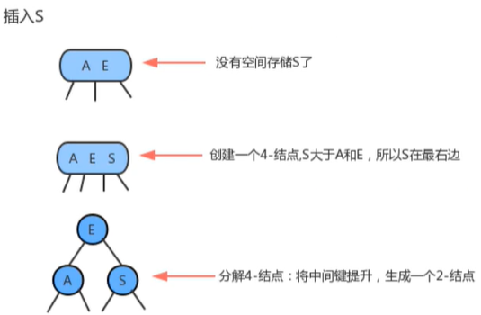


#### 1.1.3.3向个父结点为2-结点的3结点中插入新键

和上面的情况一样一样,我们也可以将新的元素插入到3-结点中,使其成为一个临时的4结点,然后,将该结点中的中间元素提升到父结点即2-结点中,使其父结点成为一个3-结点 ,然后将左右结点分别挂在这个3结点的恰当位置。

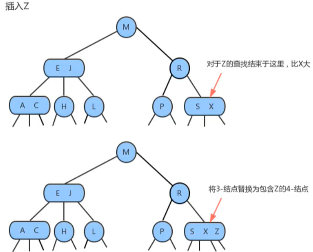

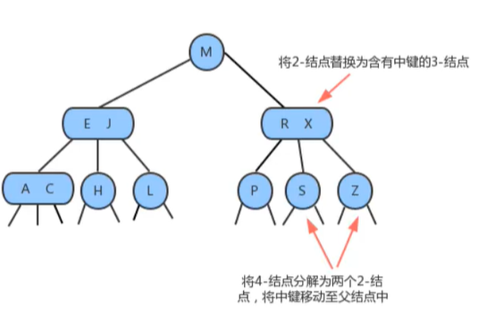

#### 1.3.1.4向一个父结点为3-结点的3-结点中插入新键
当我们插入的结点是3-结点的时候,我们将该结点拆分,中间元素提升至父结点,但是此时父结点是一个3-结点 ,插入之后,父结点变成了4结点，然后继续将中间元素提升至其父结点,直至遇到一个父结点是2-结点，然后将其变为3-结点,不需要继续进行拆分。


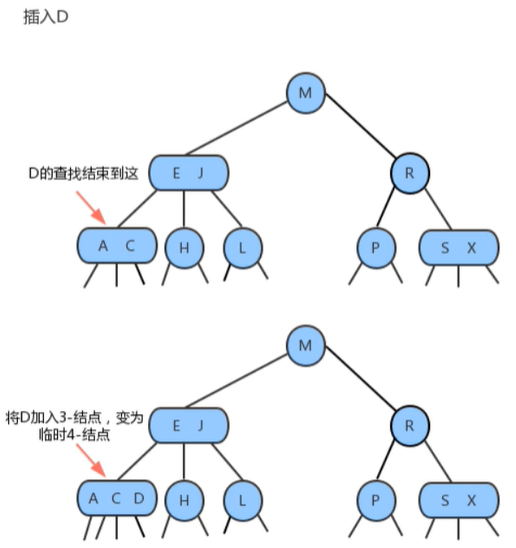

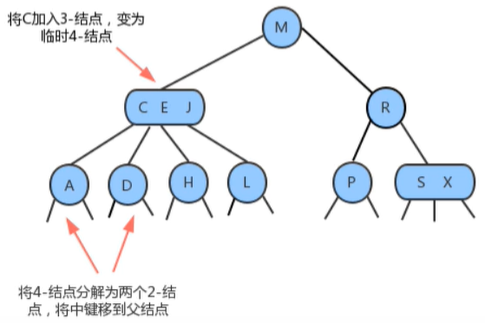

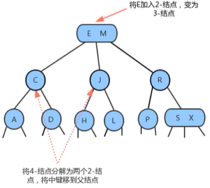

#### 1.3.1.5分解根结点
当插入结点到根结点的路径上全部是3-结点的时候,最终我们的根结点会编程一个临时的4-结点 ,此时,就需要将根结点拆分为两个2-结点,树的高度加1。

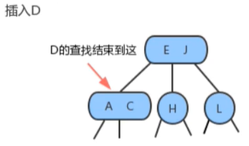

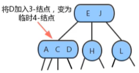


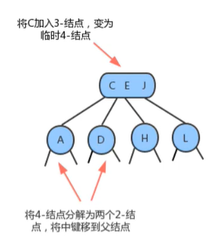

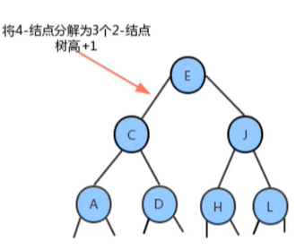


#### 1.3.4 2-3树的性质
通过对2-3树插入操作的分析,我们发现在插入的时候, 2-3树需要做一些局部的变换来保持2-3树的平衡。一 棵完全平衡的2-3树具有以下性质:

​	1.任意空链接到根结点的路径长度都是相等的。

​	2.4-结点变换为3-结点时,树的高度不会发生变化,只有当根结点是临时的4结点,分解根结点时,树高+1。

​	3.2-3树与普通二叉查找树最大的区别在于,普通的二叉查找树是**自顶向下生长**,而2-3树是**自底向上生长**。

#### 1.3.5 2-3树的实现
直接实现2-3树比较复杂,因为:

- 需要处理不同的结点类型,非常繁琐;

- 需要多次比较操作来将结点下移;

- 需要上移来拆分4-结点;

- 拆分4.结点的情况有很多种;

- 2-3查找树实现起来比较复杂,在某些情况插入后的平衡操作可能会使得效率降低。但是2-3查找树作为一 种比较重要的概念和思路对于我们后面要讲到的红黑树、B树和B+树非常重要。


## 1.2红黑树

我们前面介绍了2-3树,可以看到2 -3树能保证在插入元素之后,树依然保持平衡状态,它的最坏情况下所有子结点都是2-结点,树的高度为IgN,相比于我们普通的二叉查找树,最坏情况下树的高度为N ,确实保证了最坏情况下的时间复杂度,但是2-3树实现起来过于复杂,所以我们介绍一种2 3树思想的简单实现:红黑树。

红黑树主要是对2-3树进行编码,红黑树背后的基本思想是用标准的二叉查找树(完全由2-结点构成)和一些额外的信息(替换3-结点)来表示2-3树。我们将树中的链接分为两种类型:
 	**红链接**:将两个2结点连接起来构成一个3-结点 ;
	**黑链接**:则是2-3树中的普通链接。

确切的说,我们将3结点表示为由由一条**左斜**的红色链接(两个2结点其中之一是另一 个的左子结点)相连的两个2结点。这种表示法的一个优点是 ,我们无需修改就可以直接使用标准的二二又查找树的get方法。


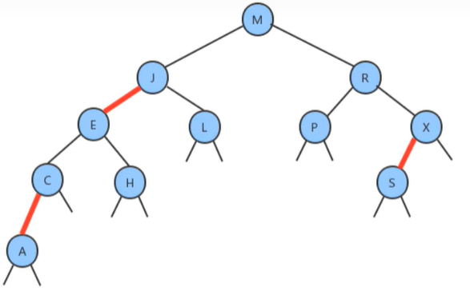

### 1.2.1红黑树的定义
红黑树是含有红黑链接并满足下列条件的二叉查找树:

​	1.红链接均为左链接;

​	2.没有任何一个结点同时和两条红链接相连;

​	3.该树是完美黑色平衡的,即任意空链接到根结点的路径上的黑链接数量相同;

下面是红黑树与2-3树的对应关系:


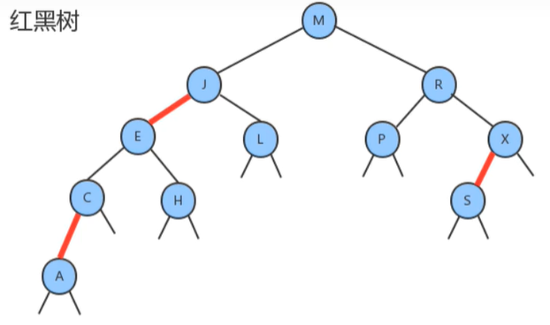

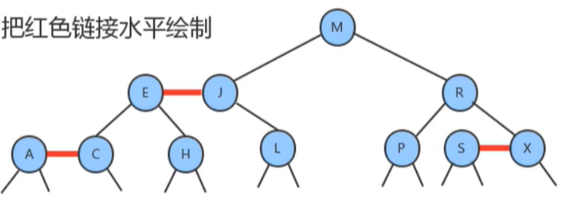

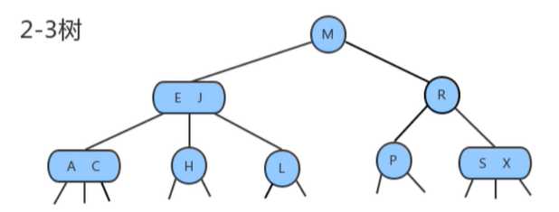

### 1.2.2红黑树结点API 

因为每个结点都只会有-条指向自己的链接(从它的父结点指向它) , 我们可以在之前的Node结点中添加一个布尔类型的变量color来表示链接的颜色。如果指向它的链接是红色的,那么该变量的值为true ,如果链接是黑色的,那么该变量的值为false.

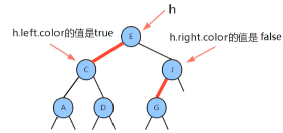

**API设计**

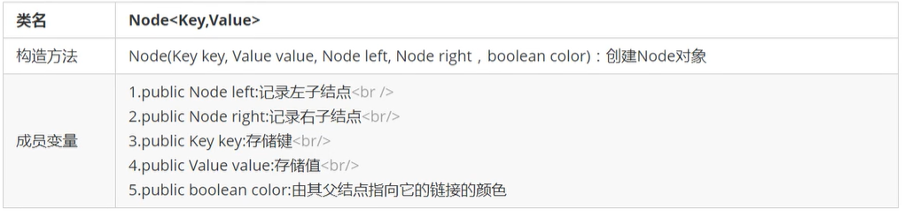

### 1.2.3平衡化
在对红黑树进行一些增删改 查的操作后,很有可能会出现红色的右链接或者两条连续红色的链接,而这些都不满足红黑树的定义,所以我们需要对这些情况通过旋转进行修复,让红黑树保持平衡。

#### 1.2.3.1左旋

当某个结点的左子结点为黑色,右子结点为红色,此时需要左旋。
**前提**:当前结点为h ,它的右子结点为x ;

**左旋过程:**

1. 让x的左子结点变为h的右子结点: h.right=x.left;
2. 让h成为x的左子结点: x.left=h;
3. 让h的color属性变为x的color属性值: x.]color=h.color;
4. 让h的color属性变为RED : h.color=true;

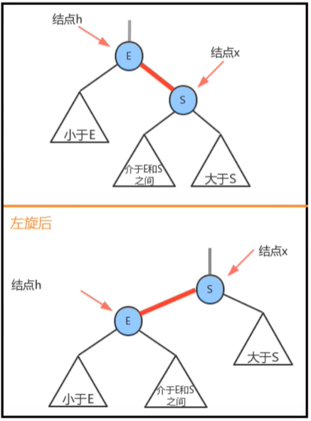


#### 1.2.3.2右旋
当某个结点的左子结点是红色,且左子结点的左子结点也是红色,需要右旋
**前提**:当前结点为h ,它的左子结点为x ;

**右旋过程:**
1.让x的右子结点成为h的左子结点: h.left = x.right;

2.让h成为x的右子结点: x.right=h;

3.让x的color变为h的color属性值: x.color = h.color;

4.让h的color为RED ;

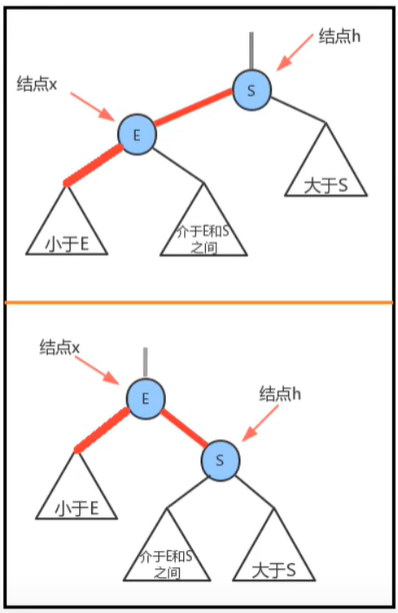


### 1.2.4向单个2-结点中插入新键

一棵只含有一个键的红黑树只含有一个2结点。插入另一个键后,我们马上就需要将他们旋转。

- 如果新键小于当前结点的键,我们只需要新增一个红色结点即可 ,新的红黑树和单个3-结点完全等价。

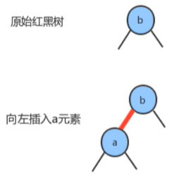

- 如果新键大于当前结点的键,那么新增的红色结点将会产生-条红色的右链接 ,此时我们需要通过左旋,把红色右链接变成左链接,插入操作才算完成。形成的新的红黑树依然和3-结点等价,其中含有两个键, 一条红色链接。

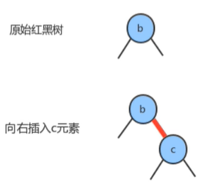

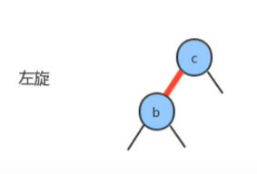


### 1.2.5向底部的2-结点插入新键

用和二又查找树相同的方式向一棵红黑树中插入一 个新键,会在树的底部新增一个结点(可以保证有序性) , 唯一区别的地方是我们会用红链接将新结点和它的父结点相连。如果它的父结点是一个2结点 ,那么刚才讨论的两种方式仍然适用。

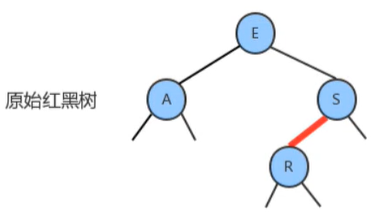

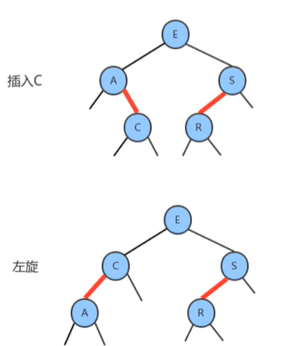


### 1.2.6颜色反转

当一个结点的左子结点和右子结点的color都为RED时,也就是出现了临时的4-结点,此时只需要把左子结点和右子结点的颜色变为BLACK ,同时让当前结点的颜色变为RED即可。


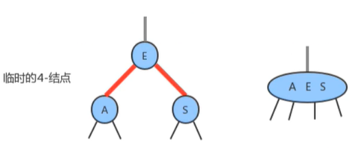

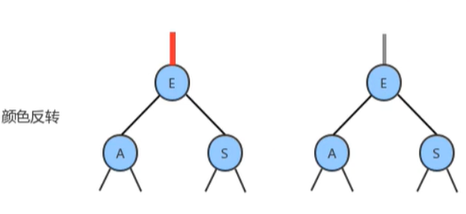

### 1.2.7向一棵双键树(即一个3-结点)中插入新键
这种情况有可以分为三种子情况:
1.新键大于原树中的两个键

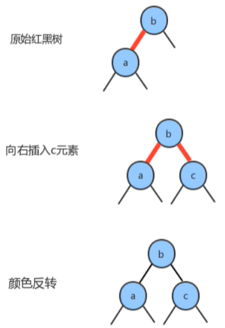

2.新键小于原树中的两个键


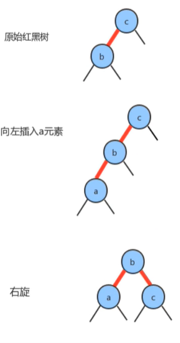

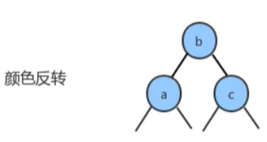

3.新键介于原数中两个键之间

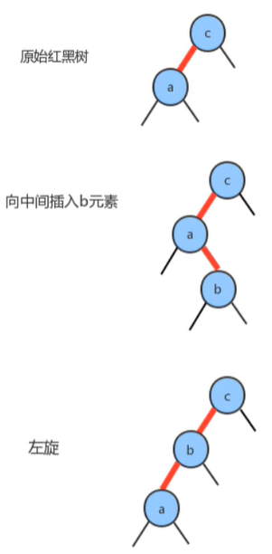


### 1.2.8根结点的颜色总是黑色
之前我们介绍结点API的时候,在结点Node对象中Color属性表示的是父结点指向当前结点的连接的颜色,由于根结点不存在父结点,所以每次插入操作后,我们都需要把根结点的颜色设置为黑色。

### 1.2.9向树底部的3-结点插入新键

假设在树的底部的一个3-结点下加入一个新的结点。前面我们所讲的3种情况都会出现。指向新结点的链接可能是3-结点的右链接(此时我们只需要转换颜色即可)，或是左链接(此时我们需要进行右旋转然后再转换)，或是中链接(此时需要先左旋转然后再右旋转，最后转换颜色)。颜色转换会使中间结点的颜色变红，相当于将它送入了父结点。这意味着父结点中继续插入一个新键，我们只需要使用相同的方法解决即可,直到遇到一个2-结点或者根结点为止。

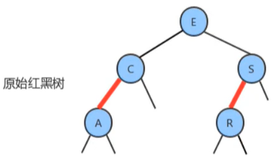

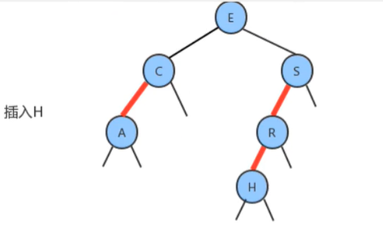

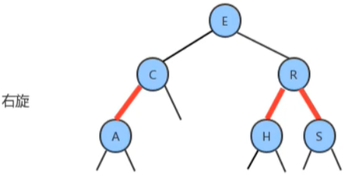

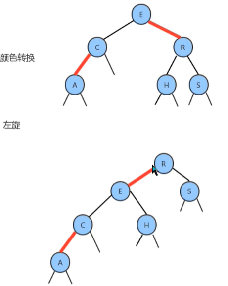

### 1.2.10红黑树的API设计

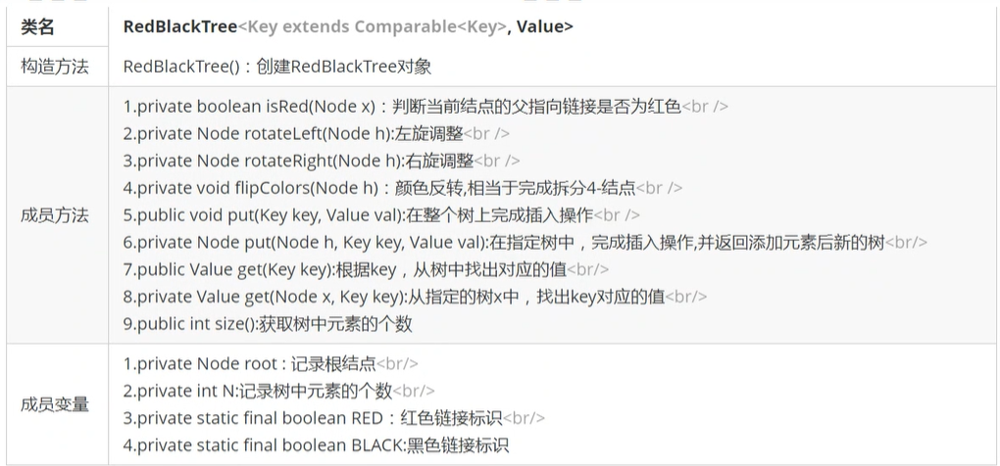

```java
//树结点
public class Node<Key extends Comparable<Key>,Value> {
    //鍵
    public Key key;
    //左节点
    public Node<Key,Value> left;
    //右节点
    public Node<Key,Value> right;
    //值
    public Value value;
    //颜色 红色true 黑色false
    public boolean color;

    public Node(Key key, Value value,boolean color) {
        this.key = key;
        this.value = value;
        this.color = color;
    }
}
```

### 1.2.11红黑树的实现

```java
//红黑树
public class RedBlackTree<Key extends Comparable<Key>,Value> {
    private static final boolean RED = true;
    private static final boolean BLACK = false;

    //根节点
    private Node<Key,Value> root;
    private int N;

    //判断当前结点的父指向链接是否是红色
    private boolean isRed(Node<Key,Value> node){
        if(node == null){
            return BLACK;
        }
        return  node.color;
    }
    //获取树中元素个数
    public int size(){
        return N;
    }
    //左旋调整
    private Node<Key,Value> rotateLeft(Node<Key,Value> h){
        //获取右节点x
        Node<Key,Value> x = h.right;
        //h的右结点指向x的左结点
        h.right = x.left;
        //x节点左结点指向h
        x.left = h;
        //x颜色变化h颜色
        x.color = h.color;
        //h颜色变成红色
        h.color = RED;

        return x;
    }

    //右旋调整
    private Node<Key,Value> rotateRight(Node<Key,Value> h){
        //获取左节点x
        Node<Key,Value> x = h.left;
        //h的左结点指向x的右结点
        h.left = x.right;
        //x节点右结点指向h
        x.right = h;
        //x颜色变化h颜色
        x.color = BLACK;
        //h颜色变成红色
        h.color = RED;

        return  x;
    }

    //颜色反转 相当完成拆分4-结点
    private void flipColors(Node<Key,Value> h ){
        h.color = RED;
        h.left.color = BLACK;
        h.right.color = BLACK;
    }
    //在整个树插入操作
    public void put(Key key,Value val){
        put(root,key,val);
        root.color = BLACK;
    }
    //在指定结点完成插入操作
    private Node<Key,Value> put(Node<Key,Value> h ,Key key,Value val){
        //判断H是否为空，如果为空,创建一个新结点红色结点
        if(h == null){
            N++;
            return new Node<>(key,val,RED);
        }
        int compareResult = key.compareTo(h.key);
        if(compareResult<0){
            h.left = put(h.left,key,val);
        } else if(compareResult >0){
            h.right = put(h.right,key,val);
        }else{
            h.value = val;
        }
        //左旋 左结点黑色 右结点是红色
        if(isRed(h.right) && !isRed(h.left)){
            h = rotateLeft(h);
        }
        //右旋 左结点红色 左结点的左结点是红色
        if(isRed(h.left) && !isRed(h.left.left)){
            h = rotateRight(h);
        }
        if(isRed(h.left) && isRed(h.right)){
            flipColors(h);
        }
        return h;
    }

    //根据Key在整个树查询
    public Value get(Key key){
        return  get(root,key);
    }

    //根据Key在指定结点查询(和二叉树一样)
    private Value get(Node<Key,Value> h ,Key key){
        if(h == null){
            return null;
        }
        int compareResult = key.compareTo(h.key);
        if(compareResult <0){
            return get(h.left,key);
        }else if(compareResult >0){
            return get(h.right,key);
        }else{
            return h.value;
        }
    }

}
```

