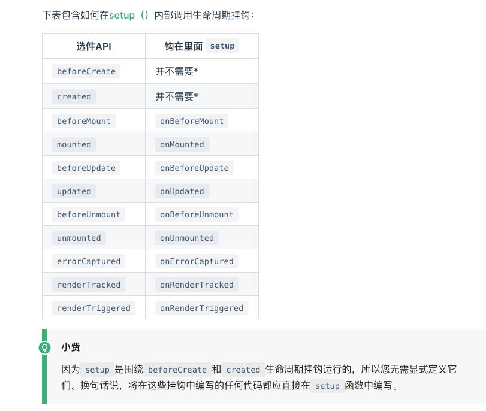

# Vue3 学习手册

### setup 

1. 内部定义变量 需要  实际操作

   ```
   import {ref} from 'vue'
   export default {
   	setup(props ,context) {
   	// 注意 this 里面setup()，this不会对当前的活动实例的引用自setup()其他组件选项都解决了之前被调用，this里面setup()会表现得很不同于this其他选项。setup()与其他Options API一起使用时，这可能会造成混乱。
   	
   	
   	 // setup 执行时 组建尚未建立 so 只能访问 props，attrs,slots, emit 不能访问 data computed methods 
    		//props  是响应式的 在没有给定默认值的情况下不能用来结构 
   	 	//	context {attrs ,slots, emit}
   	 	const data = ref(0)
   	 	return {
   	 		data ,// 在模版中你使用时不需要 data.value 引用ref 会自动解包
   	 	}
   	}
   }
   
   
   ```

2. 生命周期

